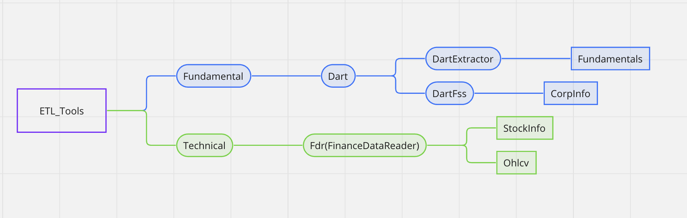
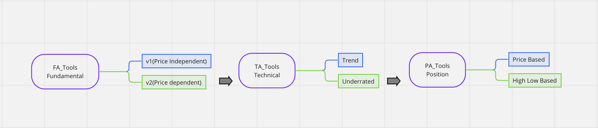
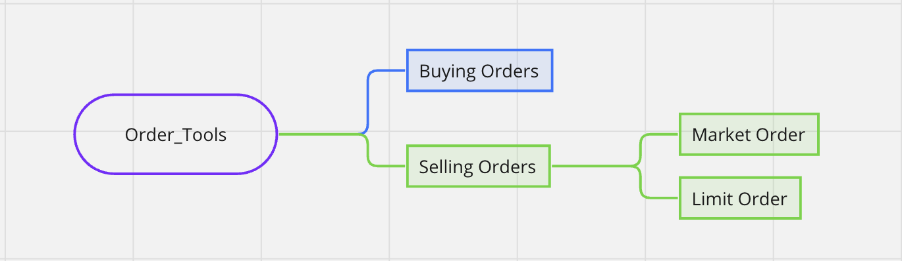

# System Trading

## ETL

- ETL Based on https://github.com/jackmappotion/system_trading_etl
- Requirements
    - dart : api-key

## Model

- fa : Fundamental Analysis
    - https://github.com/jackmappotion/system_trading_fa
- ta : Technical Analysis
    - https://github.com/jackmappotion/system_trading_ta
- pa : Position Analysis
    - https://github.com/jackmappotion/system_trading_pa
    - https://www.youtube.com/watch?v=dZPGsCARqrM

## Order
- Order using 한국투자증권 https://securities.koreainvestment.com/main/Main.jsp
- https://github.com/jackmappotion/system_trading_order
- Requirements
    - KIS Developer
        - app-key
        - app-secrete
        - acc-no
